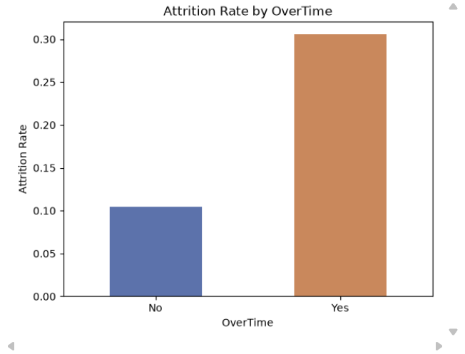
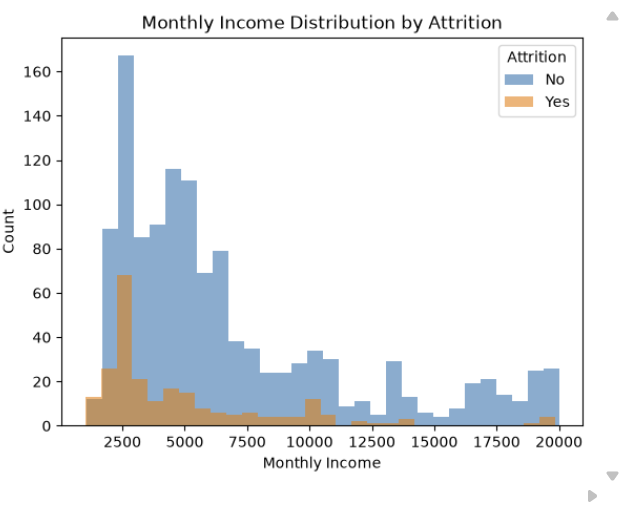
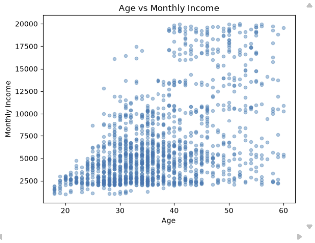
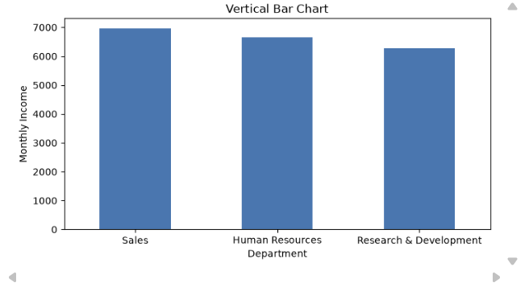
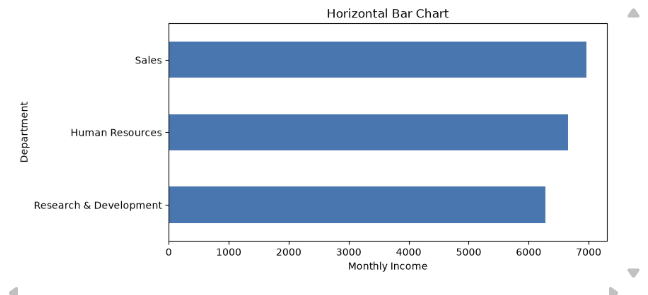

# Python 6주차 프로젝트 과제

이번 주 목표는 **시각화를 통해 분석 결과를 설득력 있게 보여주는 것**입니다.  
그래프를 많이 만드는 것보다, 각 그래프가 어떤 메시지를 전달하는지 설명하는 데 집중하세요.

**필수:** 본인의 노트북에서 진행한 내용과 실행 결과를 스크린샷으로 첨부해주세요.  
👀 수행 인증샷은 필수입니다.

노트북은 반드시 위에서 아래로 순서대로 실행해주세요. 중간 셀만 실행하면 이전에 만든 변수가 없어 오류가 날 수 있습니다.

---

## 참고 교재

- 『파이썬 라이브러리를 활용한 데이터 분석』
  - 6장 데이터 로딩과 저장, 파일 형식: p.247~309
  - 9장 그래프와 시각화: p.381~465
  - 10장 데이터 집계와 그룹 연산: p.381~465

---

## 이번 주 과제 목차

| 구분 | 내용 |
| --- | --- |
| 필수 1 | 그래프 3개 만들기 |
| 필수 2 | 그래프별 해석 작성 |
| 필수 3 | 최종 주장 후보 정리 |
| 선택 | 그래프 종류 비교 및 개선 |

---

<br>

<!-- 여기까진 그대로 둬 주세요-->

---

# 1️⃣ 필수 과제

먼저 정제 데이터를 불러오고, 그래프를 그릴 준비를 하세요. 파일명은 본인의 저장 방식에 맞게 바꿔주세요.

```python
import pandas as pd
import matplotlib.pyplot as plt

df_clean = pd.read_csv("cleaned_data.csv")
```

## 1. 그래프 3개 만들기

분석 질문과 관련 있는 그래프를 3개 이상 만드세요. 막대그래프, 선그래프, 히스토그램, 산점도 중 데이터에 맞는 것을 선택하면 됩니다.

```python
attrition_rate = pd.crosstab(df_clean["OverTime"], df_clean["Attrition"], normalize="index")["Yes"]
attrition_rate.plot(kind="bar", color=["#4C72B0", "#DD8452"])
plt.title("Attrition Rate by OverTime")
plt.xlabel("OverTime")
plt.ylabel("Attrition Rate")
plt.xticks(rotation=0)
plt.show()
```

```python
df_clean[df_clean["Attrition"] == "No"]["MonthlyIncome"].plot(kind="hist", bins=30, alpha=0.6, label="No")
df_clean[df_clean["Attrition"] == "Yes"]["MonthlyIncome"].plot(kind="hist", bins=30, alpha=0.6, label="Yes")
plt.title("Monthly Income Distribution by Attrition")
plt.xlabel("Monthly Income")
plt.ylabel("Count")
plt.legend(title="Attrition")
plt.show()
```

```python
df_clean.plot(x="Age", y="MonthlyIncome", kind="scatter", alpha=0.4)
plt.title("Age vs Monthly Income")
plt.xlabel("Age")
plt.ylabel("Monthly Income")
plt.show()
```

## 2. 그래프별 해석 작성

각 그래프가 무엇을 보여주는지, 어떤 패턴이 보이는지 적으세요.

```md
그래프 1:
보여주는 내용: 초과근무 여부에 따른 이직률 비교
해석: 초과근무를 하는 그룹의 이직률이 30.5%로, 하지 않는 그룹(10.4%)보다 3배 가까이 높다. 초과근무가 이직과 밀접하게 연관된 변수로 보인다

그래프 2:
보여주는 내용: 이직 여부 별 월 소득 분포 비교
해석: 이직자는 저소득 구간에 몰려있고, 재직자는 전체 구간에 고르게 퍼져 있음. 평균도 이직자가 4787, 재직자가 6833으로 차이가 난다. 5주차에서 본 부서별 소득-이직 관계와 같은 방향의 결과이다

그래프 3:
보여주는 내용: 나이와 월 소득 간의 산점도
해석: 나이가 많을수록 소득이 높아지는 양의 상관관계가 뚜렷하게 보인다. 다만 같은 나이대에서도 소득 편차가 커서 나이만으로 소득을 설명하기는 부족하다
```

## 3. 최종 주장 후보 정리

최종 리포트에서 강조하고 싶은 핵심 주장을 2~3개 정리하세요.

```md
주장 후보 1: 초과근무 여부가 이직과 강하게 연관되어 있다
근거: OverTime=Yes 그룹의 이직률(30.5%)이 OverTime=No 그룹(10.4%)보다 약 3배 높다

주장 후보 2: 소득 수준이 낮을수록 이직 가능성이 높다
근거: 이직자의 평균 월 소득(4787)이 재직자(6833)보다 낮고, 히스토그램에서도 이직자가 저소득 구간에 집중됨. 5주차 부서별 피벗 테이블에서도 동일한 패턴 확인된다

주장 후보 3: 나이와 소득은 어느 정도 비례하지만 변수 하나로는 설명력이 부족하다
근거: Age-MonthlyIncome 상관계수가 0.5 수준으로 중간 정도이며, 같은 나이대 안에서도 소득 편차가 커서 직급, 부서 등 다른 변수를 함께 봐야 한다
```

---

# 2️⃣ 선택 과제

같은 데이터를 기준으로 그래프 종류를 2개 그려보고, 어떤 그래프가 더 적절한지 비교해보세요.  
예를 들어 같은 그룹별 평균 데이터를 세로 막대그래프와 가로 막대그래프로 각각 그린 뒤, 어느 쪽이 더 읽기 쉬운지 설명하면 됩니다.

```python
summary = df_clean.groupby("Department")["MonthlyIncome"].mean().sort_values(ascending=False)

plt.figure(figsize=(8, 4))
summary.plot(kind="bar")
plt.title("Vertical Bar Chart")
plt.xlabel("Department")
plt.ylabel("Monthly Income")
plt.xticks(rotation=0)
plt.show()

plt.figure(figsize=(8, 4))
summary.sort_values().plot(kind="barh")
plt.title("Horizontal Bar Chart")
plt.xlabel("Monthly Income")
plt.ylabel("Department")
plt.show()
```

```md
비교한 그래프 1: 
비교한 그래프 2: 
더 적절하다고 판단한 그래프: 가로 막대그래프
그 이유: 부서명(Human Resources, Research & Development)처럼 글자 수가 긴 범주는 세로 막대그래프에서 x축 라벨이 겹치거나 회전해야 해서 읽기 불편하다. 가로 막대그래프는 범주명을 y축에 그대로 눕혀서 보여줄 수 있어 가독성이 더 좋고 직관적이다.
```

---

# 3️⃣ 제출 체크리스트

- [v] 그래프 3개 이상을 만들었다.
- [v] 각 그래프의 제목과 축 이름을 작성했다.
- [v] 그래프별 해석을 작성했다.
- [v] 최종 주장 후보를 2개 이상 정리했다.

🎉 수고하셨습니다.  
다음 주에는 지금까지의 분석 결과를 하나의 최종 리포트로 완성합니다.
